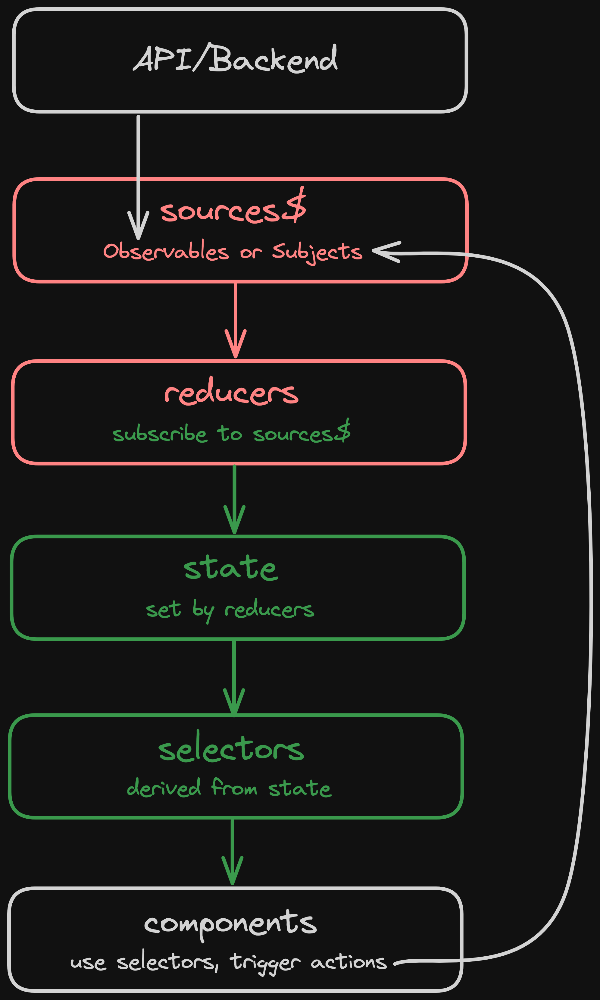

# angularstart-state-managment-with-rxjs-and-signals

angularstart, State Managment, RxJS, Signals

[[Source]](https://angularstart.com/standard/modules/basics-of-state-management/3/#state-management-with-rxjs-and-signals)

## Why a State Management Approach Matters

You might hear that you don’t need to worry about state management in Angular. Common advice is to:

> “Just use a service with a subject”

The modern Angular approach to this might be to use a service with a signal (instead of a Subject) — just like the examples we have already looked at:

```
import { Injectable, signal } from '@angular/core';

@Injectable({
  providedIn: 'root',
})
export class PreferenceService {
  #showGreeting = signal(false);
  showGreeting = this.#showGreeting.asReadonly();

  toggleGreeting() {
    this.#showGreeting.update((showGreeting) => !showGreeting);
  }
}
```

Why worry about a “state management” approach when we can just do something simple like this? We can even extend this to deal with the asynchronous reactivity problem we talked about in the last lesson by including RxJS and observables.

Again, why worry about a “state management” approach?

The problem is that you already are using a state management approach. If you are managing state, and you don’t have an idea of specifically what your “state management approach” is, then your state management approach is just an ad-hoc state management approach that you make up on a case-by-case basis.

If you haven’t rigidly defined how you are going to approach state, then you might create a mess of different ideas dealing with different types of situations. It will also be especially hard to communicate to other developers how state should be managed — maybe some other developers on the project have slightly different ideas of how state should be managed.

## State Management with RxJS and Signals

In this course, we will be using an explicitly defined approach to state management that uses **RxJS** and **Signals**.

However, for this course we will not be using a state management library. There are two main reasons for this.

> A big part of this course is learning the mechanisms of Angular and how everything works. State management libraries often make things more convenient, but they also hide implementation details. For the purposes of learning Angular and the concepts of state management, I think we would lose something by just using a state management library

> State management libraries often get a bad rap for being “too complicated”. Part of the problem is that state management libraries need to handle all (or at least most) situations for everyone. This often means there are lots of concepts, and abstractions, and features that you might not need. In the context of this course, I think this would detract from the goals.

Instead, I have broken down what I think are the key concepts of an ideal state management solution, and I have come up with a state management approach that is both simple but does not sacrifice on our goals of being as reactive and declarative as possible.

## How it works



It shows how data flows into the application, how it flows through our state management process, how it eventually is consumed by our components, and also how the components can then interact with the state management flow.

I’ve also colour coded this diagram to indicate which parts of the state management process are handled by RxJS (red), which are handled by Signals (green), and where the transition between the two is.

### State

Our state is not really the start of this process, but it is hard for our state to have somewhere to flow to without first defining what that state looks like.

So, we typically begin by creating an interface that describes what our state looks like.

```
interface ChecklistState {
  checklist: Checklist | null;
  loaded: boolean;
}
```

We want to keep track of two bits of state: the checklist itself (which will be null if it has not loaded yet), and a loaded flag that keeps track of whether the checklist has been loaded yet or not.

We can then use this interface when setting up our state signal:

```
  // state
  state = signal<ChecklistState>({
    checklist: null,
    loaded: false
  })
```

We create a signal for our state, supplying some initial values for the state we are interested in.

### Sources

Everything begins at the source. This is where the data first flows into our application. It may flow in from *outside* of the application, but it may also flow in from *inside* of the application — kind of like water that has somehow been sent back up to the top of the waterfall.

Our sources will either be a standard observable, or a Subject. We will use observables if our source is something like an HTTP request to some backend — this is the situation where data is flowing in from outside of our application.

If we need to **imperatively** interact with the state in some way — for example we might have some user action like adding a comment that we need to trigger manually — then we will use a ```Subject```. We can manually ```next``` a ```Subject``` at some point, and then we can react to that — either by deriving some new source from that action, or in the reducer step. This is the situation where data is flowing in from *inside* of our application. It is uglier, because it is imperative — water does not generally flow up the stream — it is, however, necessary at times.

Continuing with our ```checklist``` example, we might formally set this up like this:

```
  // state
  state = signal<ChecklistState>({
    checklist: null,
    loaded: false
  })

  // sources
  checklist$ = this.http.get<string>('someapi');
```

We have a source now, but without the rest of our process it doesn’t do anything — our state signal remains unchanged.

### Reducers

The role of the reducer is to take the value from some **event** or **action** communicated through a **source** and determine how the current state should be updated as a result.

We might be dealing with an HTTP source emitting some data, or we might be dealing with some ```Subject``` that has been nested as a result of some user action.

To take a value out of a reactive mechanism like an observable we need to ```subscribe``` to it. You may recall we have often talked about the importance of avoiding manual subscribes. This is an intentional design decision with this state management approach.

Let’s take a look at what this **reducer** looks like and then discuss *why* we are doing it this way:

```
  // state
  state = signal<ChecklistState>({
    checklist: null,
    loaded: false,
  });

  // sources
  checklist$ = this.http.get<string>('someapi');

  constructor() {
    // reducers
    this.checklist$
      .pipe(takeUntilDestroyed())
      .subscribe((checklist) =>
        this.state.update((state) => ({ ...state, checklist, loaded: true }))
      );
  }
```

We ```subscribe``` to the ```checklist$``` source — note that we use ```takeUntilDestroyed()``` to clean up the subscription — and we take the value emitted from the ```checklists$``` source and use it to update our state signal.

We will always use this spreading syntax when updating the state signal:

```
{ ...state, checklist, loaded: true }
```

By doing this:

```
{ ...state }
```

We will get a new object that has all the same properties and values as the original ```state``` that we are updating. We then supply the values in the state we want to update (in this case we want to update both ```checklist``` and ```loaded```).

This means in this particular case using ```...state``` is completely pointless, because we are supplying all of the values of the object anyway. However, imagine we add an extra value to our state later — now we would need to make sure we come back and update all of our reducers. If we just use ```{...state}``` by default, and overwrite properties, we won’t have this problem.

I said we would talk about *why* we are using a manual subscribe here. Technically, we can get our data flowing from RxJS to Signals *without* using a manual ```subscribe```. We *could* use ```toSignal```.

If we use ```toSignal``` the ```subscribe``` would still be happening under the hood anyway — ```toSignal``` works by subscribing to the observable you supply it. There is no getting around the fact that the observable needs to be subscribed to in order to pull its value out. But at least with ```toSignal``` we wouldn’t have to worry about the subscription ourselves.

The real reason we are using the manual subscribe is that it provides us with a greater deal of flexibility in the reducer step. In the reducer step, we can access **all** of the current state in the state object, and update any of the state however we like. This is kind of like an imperative shortcut or cheat, and it is actually not as “declarative” as keeping everything completely in streams. However, I think it strikes a nice balance. It still provides a lot of the benefits of declarative code, but it makes things *a lot* simpler.

We briefly take our data out of a reactive flow (RxJS), we have one small moment where we can imperatively set the state, and then our data goes right back into a different type of reactive flow (Signals).

One key rule to follow here is to *never do anything else in the subscribe*. You should only update the ```state``` object using the previous ```state``` value and the value from the ```source``` that just emitted. No triggering any other code/side effects, no fetching other external values to set in your state. This will make the code less declarative.

To be clear, this is *naughty*:

```
  constructor() {
    // reducers
    this.checklist$.pipe(takeUntilDestroyed()).subscribe((checklist) => {
      // Do NOT do this:
      // this.doSomething()
      this.state.update((state) => ({ ...state, checklist, loaded: true }));
    });
  }
```

To avoid this temptation, make it a rule to never use curly braces for your ```subscribe```, e.g do this:

```
  .subscribe((checklist) =>
    this.state.update((state) => ({ ...state }))
  );
```

*Not* this:

```
.subscribe((checklist) => {
  this.state.update((state) => ({ ...state }))
});
```

It is much easier to sneak imperative side effects into the second example.

For situations where we need side effects we have an explicit way of handling that which we will talk about in a moment.

### Selectors

We now have data flowing from our **sources**, through our **reducers**, and into our **state**. Now we need to use that state.

We have a ```signal``` so we can just access the entire signal and use it wherever we need. But it is more efficient, and often convenient, to just select the specific things we need from the state.

For example, one part of the code might just be interested in knowing if the ```loading``` flag is ```true``` or ```false```. It does not need *all* of the values in the state, and it does not need to be notified when any of those state values update.

So, we create selectors like this:

```
  // state
  state = signal<ChecklistState>({
    checklist: null,
    loaded: false,
  });

  // selectors
  checklist = computed(() => this.state().checklist);
  loaded = computed(() => this.state().loaded);

  // sources
  checklist$ = this.http.get<string>('someapi');

  constructor() {
    // reducers
    this.checklist$
      .pipe(takeUntilDestroyed())
      .subscribe((checklist) =>
        this.state.update((state) => ({ ...state, checklist, loaded: true }))
      );
  }
```

This forms the public interface for the state — if some component wants to access some state information it will use one of these “selectors”. Since they use **computed** they will update any time the value in the signal they are derived from updates.

### Side effects

If we are coding reactively/declaratively then **side effects** are best avoided. A side effect is kind of a fancy way of referring to some arbitrary code that is triggered when something happens.

The reason they are best avoided is because they are by definition **imperative**. However, sometimes a side effect can be useful or even necessary.

Logging is a common example of this — maybe we want to send some analytics event any time a ```checklist``` is loaded into the application. We could create a side ```effect``` using the effect API that is part of Angular Signals:

```
    effect(() => {
      if (this.checklist()) {
        // send this data to some backend/logging service
        console.log(this.checklist());
      }
    });
```

This ```effect``` will run once initially, and once every time the value of ```checklist``` changes. We will use side effects sometimes in the applications we build — a couple of examples being to save data into storage when things change, and to trigger navigations when certain things happen.

Side effects like this are fine primarily when you are just *making something happen* not triggering some state change in your application. For example, we typically want to avoid doing things like this:

```
    effect(() => {
      if (this.checklist()) {
        this.loaded.set(true);
      }
    }, {allowSignalWrites: true});
```

If we pretend we have a separate ```loaded``` signal, we might think the above is a good way to set the loading state. It works, but it makes the code more imperative. If we want to modify the state of the application we should do it using our state management process.

**NOTE**: Even Angular tries to warn you this isn’t the best idea, as you need to explicitly enable “signal writes” in order to do this. Part of the danger here is that if we write to signals in effects, those signal updates might trigger more effects, which trigger more signal updates, and more effects, and so on.

The important thing to remember about side effects is that if you do need to create a side effect, it should only be triggered in an ```effect``` as a result of some state changing. If you find yourself wanting to do something like adding a ```ngOnInit``` or calling some other method in your code in order to trigger some side effect, you should consider whether there is a better design. Often it will mean that you are circumventing the state management process.
